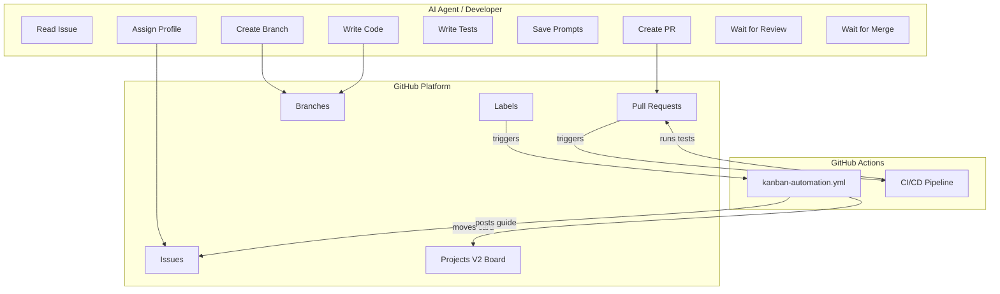
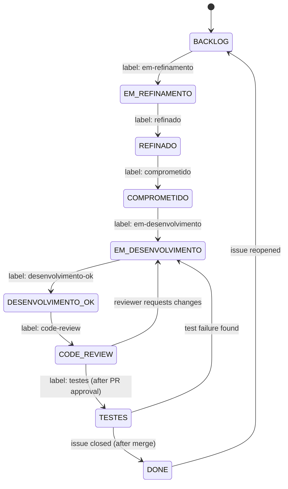

# Design Document — MenteMX Pro Development Workflow

## Overview

This design describes the automated development workflow for the MenteMX Pro project. It is a **process/workflow specification** — not a code feature — that defines how an AI agent (or human developer) interacts with GitHub to move issues through a 9-stage Kanban board while maintaining code quality, traceability, and sequential delivery.

The workflow orchestrates:
- Issue assignment and Kanban transitions via GitHub labels
- Branch creation and Conventional Commits enforcement
- Code placement within the monorepo structure
- Test creation and CI/CD execution
- Prompt logging for AI-assisted development
- Pull Request lifecycle (creation → review → merge)
- Sequential task gating (one PR at a time unless explicitly overridden)

### Design Rationale

The workflow is designed as a **state machine** where each state corresponds to a Kanban column. Transitions are triggered by label changes, which in turn trigger GitHub Actions that move project cards and post stage-specific guides. The AI agent is responsible for executing the "happy path" transitions while respecting human-gated checkpoints (code review and merge).

---

## Architecture

### High-Level Architecture



### Workflow State Machine



### Interaction Model

The workflow has two types of actors:
1. **Autonomous Actor (AI Agent)**: Executes steps from assignment through PR creation. Can add labels, create branches, write code, run tests, and open PRs.
2. **Human-Gated Actor (Owner/Reviewer)**: Performs code review and merge. The AI agent MUST wait at these checkpoints.

---

## Components and Interfaces

### 1. Workflow Orchestrator (Agent Logic)

The orchestrator is the decision-making component that determines which step to execute next based on the current state of the issue.

**Interface:**
```typescript
interface WorkflowOrchestrator {
  // Determine current state of an issue
  getIssueState(issueNumber: number): Promise<WorkflowState>;
  
  // Execute the next step in the workflow
  executeNextStep(issueNumber: number): Promise<StepResult>;
  
  // Check if a new issue can be started
  canStartNewIssue(): Promise<{ allowed: boolean; reason?: string }>;
  
  // Validate dependencies before transitioning
  validateDependencies(issueNumber: number): Promise<DependencyCheck>;
}
```

### 2. GitHub Operations Interface

Abstracts all interactions with the GitHub API via `gh` CLI.

**Interface:**
```typescript
interface GitHubOperations {
  // Issue operations
  assignIssue(issueNumber: number, assignee: string): Promise<void>;
  addLabel(issueNumber: number, label: string): Promise<void>;
  removeLabel(issueNumber: number, label: string): Promise<void>;
  getIssueLabels(issueNumber: number): Promise<string[]>;
  
  // Branch operations
  createBranch(name: string, base: string): Promise<void>;
  getCurrentBranch(): Promise<string>;
  
  // PR operations
  createPullRequest(params: PRParams): Promise<PRResult>;
  getPRStatus(prNumber: number): Promise<PRStatus>;
  
  // Query operations
  getOpenPRs(): Promise<PR[]>;
  getIssueDependencies(issueNumber: number): Promise<number[]>;
}

interface PRParams {
  title: string;       // Conventional Commits format
  body: string;        // Includes "Closes #<number>"
  base: string;        // Always "main"
  head: string;        // Feature branch name
}
```

### 3. File System Operations

Manages code placement and prompt logging.

**Interface:**
```typescript
interface FileSystemOperations {
  // Validate file is within project directory
  validateFilePath(path: string): boolean;
  
  // Save prompt log
  savePromptLog(issueNumber: number, prompt: PromptEntry): Promise<string>;
  
  // Get project directory structure
  getProjectStructure(): Promise<DirectoryTree>;
}
```

### 4. CI/CD Integration

Manages test execution and pipeline status.

**Interface:**
```typescript
interface CICDIntegration {
  // Run local tests
  runLocalTests(): Promise<TestResult>;
  
  // Check CI status on PR
  getCIStatus(prNumber: number): Promise<CIStatus>;
  
  // Wait for CI completion
  waitForCI(prNumber: number, timeout: number): Promise<CIResult>;
}
```

### 5. Kanban Automation (GitHub Actions)

Already implemented in `.github/workflows/kanban-automation.yml`. Handles:
- Card movement on label changes
- Stage guide posting as comments
- Dependency validation on "Em Desenvolvimento" transition

---

## Data Models

### Workflow State

```typescript
type WorkflowState = 
  | 'BACKLOG'
  | 'EM_REFINAMENTO'
  | 'REFINADO'
  | 'COMPROMETIDO'
  | 'EM_DESENVOLVIMENTO'
  | 'DESENVOLVIMENTO_OK'
  | 'CODE_REVIEW'
  | 'TESTES'
  | 'DONE';

const LABEL_TO_STATE: Record<string, WorkflowState> = {
  'status: em-refinamento': 'EM_REFINAMENTO',
  'status: refinado': 'REFINADO',
  'status: comprometido': 'COMPROMETIDO',
  'status: em-desenvolvimento': 'EM_DESENVOLVIMENTO',
  'status: desenvolvimento-ok': 'DESENVOLVIMENTO_OK',
  'status: code-review': 'CODE_REVIEW',
  'status: testes': 'TESTES',
};

const VALID_TRANSITIONS: Record<WorkflowState, WorkflowState[]> = {
  'BACKLOG': ['EM_REFINAMENTO'],
  'EM_REFINAMENTO': ['REFINADO'],
  'REFINADO': ['COMPROMETIDO'],
  'COMPROMETIDO': ['EM_DESENVOLVIMENTO'],
  'EM_DESENVOLVIMENTO': ['DESENVOLVIMENTO_OK'],
  'DESENVOLVIMENTO_OK': ['CODE_REVIEW'],
  'CODE_REVIEW': ['TESTES', 'EM_DESENVOLVIMENTO'],  // Can go back on changes requested
  'TESTES': ['DONE', 'EM_DESENVOLVIMENTO'],          // Can go back on test failure
  'DONE': ['BACKLOG'],                                // Reopen
};
```

### Branch Naming

```typescript
interface BranchName {
  type: 'feat' | 'fix' | 'docs' | 'chore';
  slug: string;  // kebab-case, derived from issue title
}

// Pattern: <type>/<slug>
// Example: feat/cadastro-piloto, fix/sync-conflito
const BRANCH_PATTERN = /^(feat|fix|docs|chore)\/[a-z0-9]+(-[a-z0-9]+)*$/;
```

### Conventional Commit

```typescript
interface ConventionalCommit {
  type: 'feat' | 'fix' | 'docs' | 'chore' | 'test' | 'refactor' | 'style' | 'perf';
  scope?: string;
  description: string;  // lowercase, no period at end
}

// Pattern: <type>(<scope>): <description>
const COMMIT_PATTERN = /^(feat|fix|docs|chore|test|refactor|style|perf)(\([a-z-]+\))?: [a-z].+[^.]$/;
```

### Prompt Log Entry

```typescript
interface PromptEntry {
  issueNumber: number;
  date: string;          // ISO 8601 format
  objective: string;     // What the prompt aimed to achieve
  prompt: string;        // The actual prompt text
  result: string;        // Summary of what was produced
}

// File naming: issue-<number>-<short-description>.md
// Location: /src/MenteMX-Pro-App/docs/prompts/
const PROMPT_FILE_PATTERN = /^issue-\d+-[a-z0-9-]+\.md$/;
```

### Project Directory Structure

```
/src/MenteMX-Pro-App/
├── apps/
│   ├── mobile/          # React Native / Expo app
│   └── backend/         # API server
├── packages/
│   └── core/            # Shared business logic
└── docs/
    └── prompts/         # Prompt logs per issue
```

### Dependency Map

```typescript
// Maps issue number to its dependency issue numbers
type DependencyMap = Record<number, number[]>;

// An issue can only move to EM_DESENVOLVIMENTO if all dependencies are closed
function canStartDevelopment(issueNumber: number, deps: DependencyMap, closedIssues: Set<number>): boolean {
  const issueDeps = deps[issueNumber] ?? [];
  return issueDeps.every(dep => closedIssues.has(dep));
}
```

### Sequential Gating

```typescript
interface SequentialGate {
  // Check if there's an open PR blocking new work
  hasOpenPR(): Promise<boolean>;
  
  // Check if parallel work was explicitly authorized
  isParallelAuthorized(): Promise<boolean>;
  
  // Combined check
  canStartNewWork(): Promise<{ allowed: boolean; blockingPR?: number }>;
}
```

