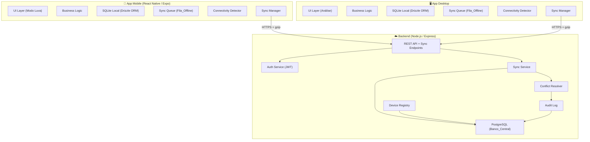
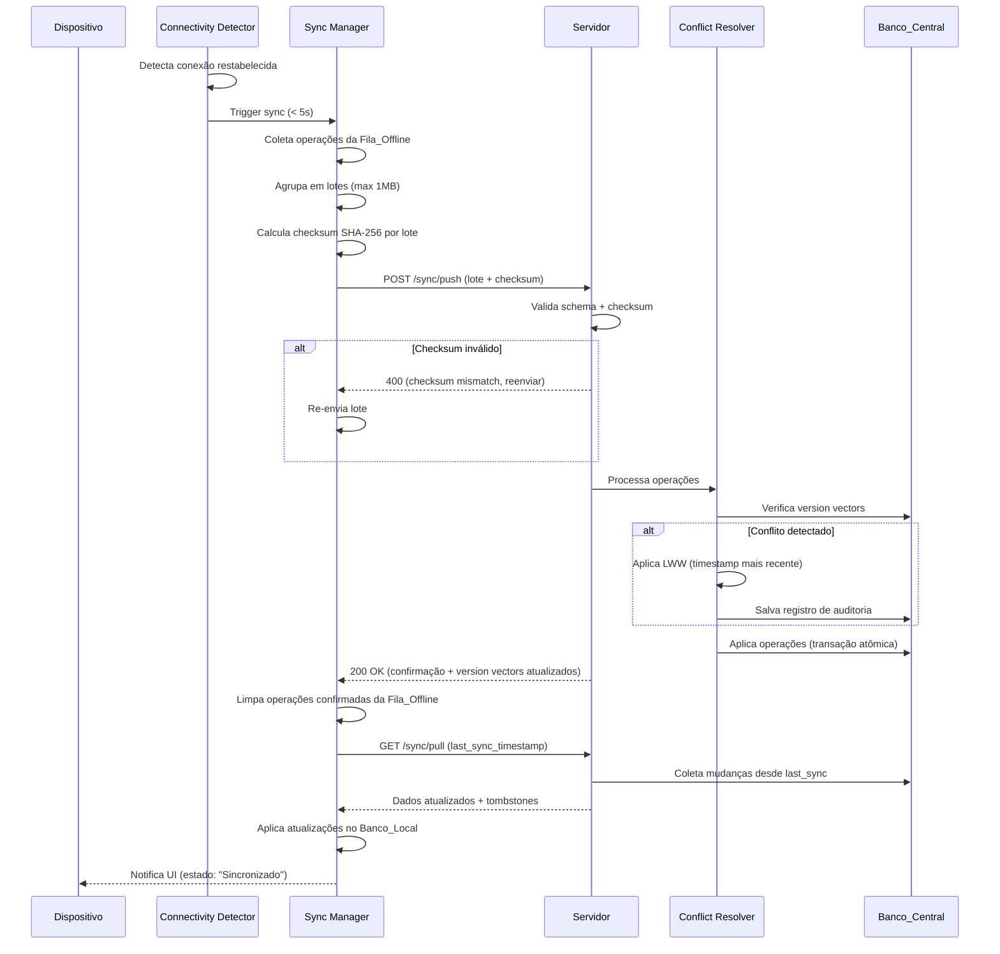
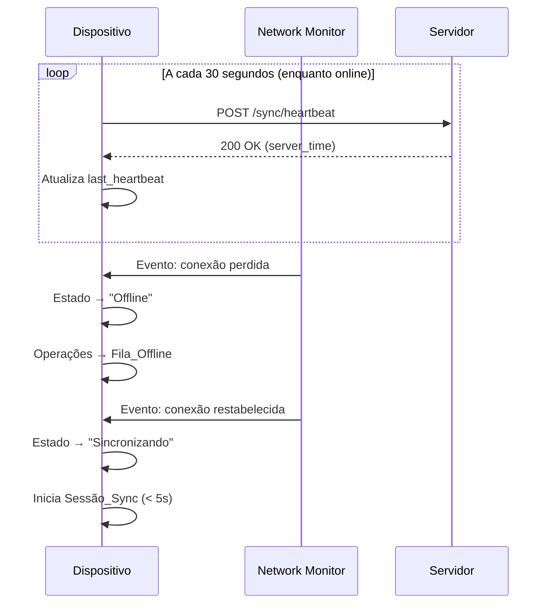
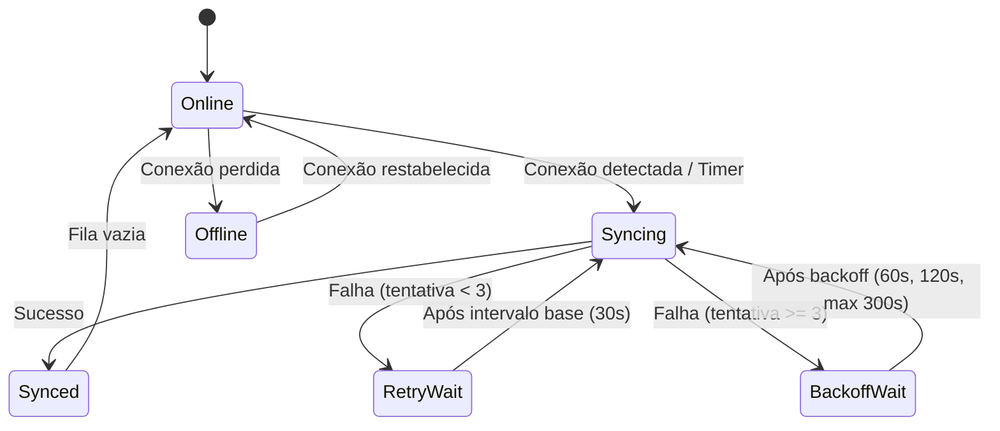
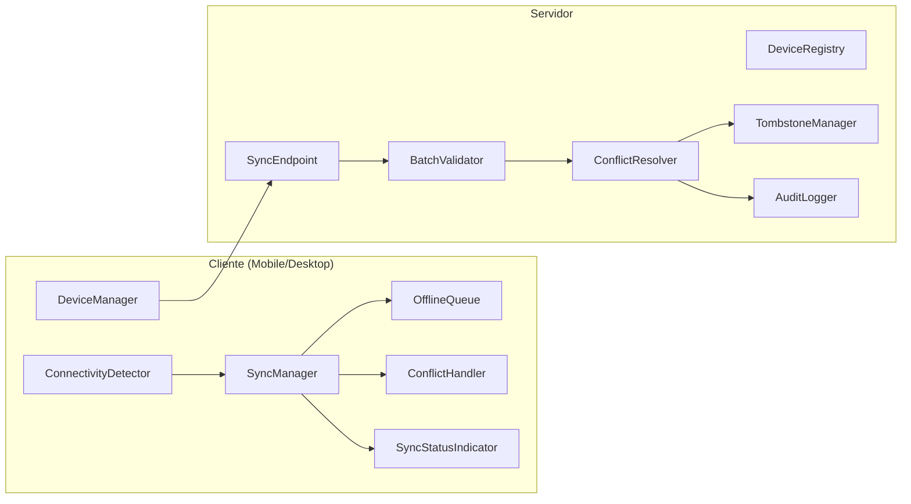
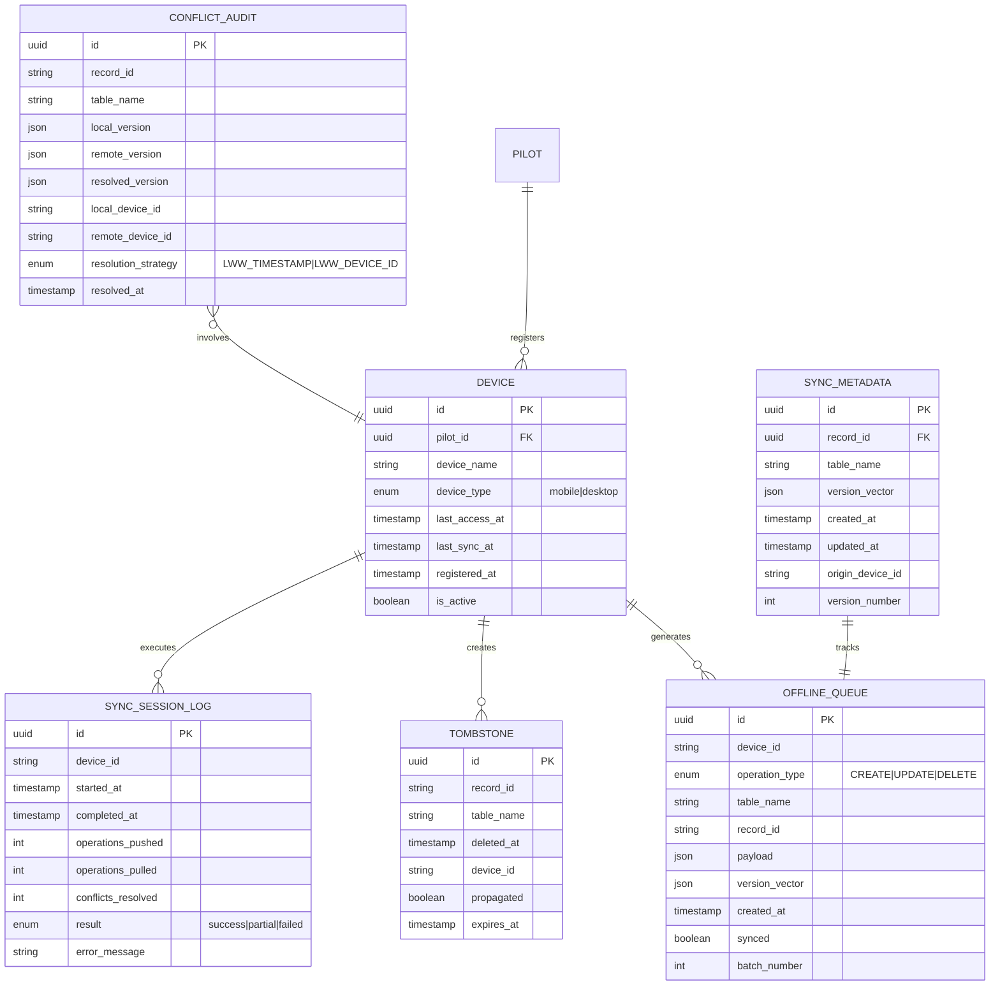
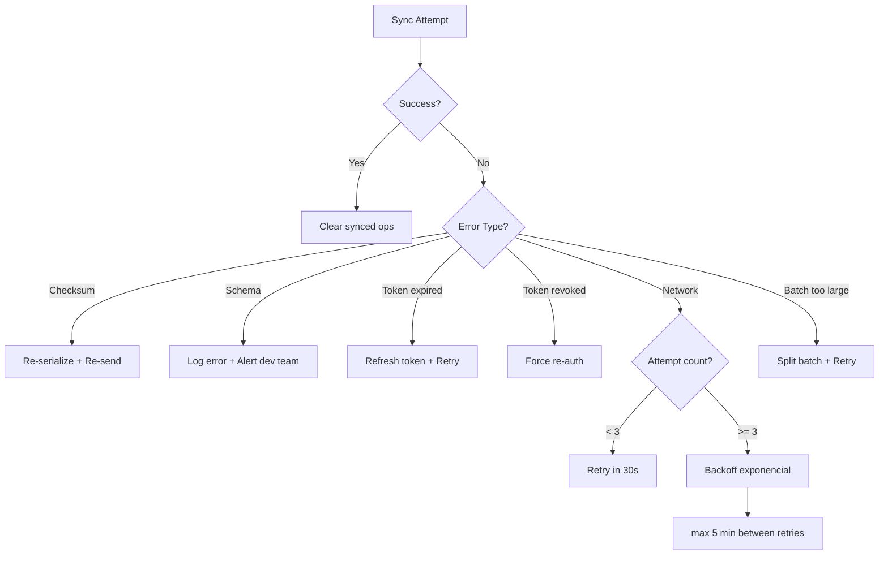

# Design Document — Multi-Device Offline Sync

## Overview

Este documento descreve o design técnico da funcionalidade de **Sincronização Multi-Dispositivo Offline** do MenteMX Pro. O objetivo é expandir a arquitetura Local-First existente para suportar até 5 dispositivos (mobile e desktop) operando de forma coordenada, com sincronização automática via servidor central.

### Cenário Crítico

Pilotos de Motocross treinam em pistas remotas sem conectividade. O App_Mobile registra dados na pista (Modo Luva), e o App_Desktop é usado em casa para análise. Ambos devem funcionar 100% offline e convergir automaticamente quando a internet estiver disponível.

### Decisões de Design Principais

| Decisão | Escolha | Rationale |
|---|---|---|
| Estratégia de conflito | LWW com Vetores de Versão | Determinístico, simples de implementar, adequado para uso individual |
| Detecção de conflito | Vetores de Versão (version vectors) | Detecta causalidade entre edições, superior a timestamp puro |
| Desempate | Ordem lexicográfica do device_id | Determinístico quando timestamps são idênticos |
| Exclusão distribuída | Tombstones com TTL de 90 dias | Garante propagação para dispositivos offline por longos períodos |
| Protocolo de sync | JSON versionado com checksum SHA-256 | Extensível, verificável, debugável |
| Transporte | HTTPS + TLS 1.2+ com compressão gzip | Seguro e eficiente para conexões limitadas |
| Autenticação | JWT de curta duração (1h) + refresh token | Segurança sem interrupção de sync |
| Criptografia local | AES-256 vinculada ao dispositivo | Proteção de dados em repouso |
| Batch size | Máximo 1 MB por lote | Evita timeouts em conexões instáveis |
| Retry strategy | Backoff exponencial (30s, 60s, 120s, max 5min) | Resiliência sem sobrecarga do servidor |

---

## Architecture

### Visão Geral do Sistema



### Fluxo de Sincronização Completo



### Heartbeat e Detecção de Conectividade



### Estratégia de Retry com Backoff Exponencial



---

## Components and Interfaces

### Módulos do Sistema de Sincronização



### Interfaces TypeScript — Cliente

```typescript
// === Device Management ===

interface DeviceInfo {
  deviceId: string;          // UUID v4 gerado no primeiro login
  deviceName: string;        // Nome atribuído pelo piloto
  deviceType: 'mobile' | 'desktop';
  lastAccessAt: Date;
  lastSyncAt: Date | null;
  isCurrentDevice: boolean;
}

interface DeviceManager {
  registerDevice(name: string, type: 'mobile' | 'desktop'): Promise<DeviceInfo>;
  listDevices(): Promise<DeviceInfo[]>;
  removeDevice(deviceId: string): Promise<void>;
  getCurrentDevice(): DeviceInfo;
}

// === Offline Queue ===

interface OfflineOperation {
  id: string;               // UUID v4
  deviceId: string;
  operationType: 'CREATE' | 'UPDATE' | 'DELETE';
  tableName: string;
  recordId: string;
  payload: Record<string, unknown>;
  versionVector: VersionVector;
  createdAt: Date;
  synced: boolean;
}

interface OfflineQueue {
  enqueue(operation: Omit<OfflineOperation, 'id' | 'synced' | 'createdAt'>): Promise<void>;
  getPending(): Promise<OfflineOperation[]>;
  markSynced(operationIds: string[]): Promise<void>;
  clear(): Promise<void>;
  getCount(): Promise<number>;
  persistsAcrossRestarts(): boolean; // invariante: sempre true
}

// === Sync Manager ===

interface SyncBatch {
  protocolVersion: string;   // semver, e.g. "1.0.0"
  deviceId: string;
  batchTimestamp: Date;
  operations: OfflineOperation[];
  checksum: string;          // SHA-256 do array de operações serializado
}

interface SyncResult {
  success: boolean;
  syncedOperationIds: string[];
  conflicts: ConflictResolution[];
  updatedVersionVectors: Record<string, VersionVector>;
  serverTimestamp: Date;
}

interface SyncManager {
  startSync(): Promise<SyncResult>;
  getStatus(): SyncStatus;
  forceSync(): Promise<SyncResult>;
  onStatusChange(callback: (status: SyncStatus) => void): () => void;
}

type SyncStatus = 
  | { state: 'synced'; lastSyncAt: Date }
  | { state: 'pending'; pendingCount: number }
  | { state: 'syncing'; progress: number }
  | { state: 'offline' }
  | { state: 'error'; retryIn: number; attempts: number };

// === Connectivity Detection ===

interface ConnectivityDetector {
  isOnline(): boolean;
  onConnectivityChange(callback: (online: boolean) => void): () => void;
  getConnectionQuality(): 'high' | 'low' | 'offline';
}

// === Version Vectors ===

type VersionVector = Record<string, number>; // { deviceId: version_counter }

interface VersionVectorService {
  increment(vector: VersionVector, deviceId: string): VersionVector;
  merge(local: VersionVector, remote: VersionVector): VersionVector;
  dominates(a: VersionVector, b: VersionVector): boolean;
  concurrent(a: VersionVector, b: VersionVector): boolean;
}

// === Conflict Resolution ===

interface ConflictResolution {
  recordId: string;
  tableName: string;
  localVersion: { payload: Record<string, unknown>; updatedAt: Date; deviceId: string };
  remoteVersion: { payload: Record<string, unknown>; updatedAt: Date; deviceId: string };
  resolvedVersion: 'local' | 'remote';
  resolvedAt: Date;
}

interface ConflictHandler {
  resolve(local: OfflineOperation, remote: OfflineOperation): ConflictResolution;
  getHistory(days: number): Promise<ConflictResolution[]>;
}

// === Tombstones ===

interface Tombstone {
  id: string;
  recordId: string;
  tableName: string;
  deletedAt: Date;
  deviceId: string;
  propagated: boolean;
}

interface TombstoneService {
  create(recordId: string, tableName: string): Promise<Tombstone>;
  getPending(): Promise<Tombstone[]>;
  apply(tombstone: Tombstone): Promise<void>;
  shouldApply(tombstone: Tombstone, localRecord: { updatedAt: Date } | null): boolean;
}
```

### Interfaces TypeScript — Servidor

```typescript
// === Sync Endpoint ===

interface SyncPushRequest {
  protocolVersion: string;
  deviceId: string;
  batchTimestamp: string;    // ISO 8601
  operations: SyncOperationPayload[];
  checksum: string;
}

interface SyncOperationPayload {
  id: string;
  operationType: 'CREATE' | 'UPDATE' | 'DELETE';
  tableName: string;
  recordId: string;
  payload: Record<string, unknown>;
  versionVector: VersionVector;
  createdAt: string;         // ISO 8601
}

interface SyncPushResponse {
  success: boolean;
  syncedOperationIds: string[];
  conflicts: ConflictAuditRecord[];
  updatedVersionVectors: Record<string, VersionVector>;
  serverTimestamp: string;
}

interface SyncPullRequest {
  deviceId: string;
  lastSyncTimestamp: string; // ISO 8601
  protocolVersion: string;
}

interface SyncPullResponse {
  operations: SyncOperationPayload[];
  tombstones: TombstonePayload[];
  serverTimestamp: string;
  hasMore: boolean;          // paginação para grandes volumes
}

// === Conflict Audit ===

interface ConflictAuditRecord {
  id: string;
  recordId: string;
  tableName: string;
  conflictingDevices: string[];
  localVersion: Record<string, unknown>;
  remoteVersion: Record<string, unknown>;
  resolvedVersion: Record<string, unknown>;
  resolutionStrategy: 'LWW_TIMESTAMP' | 'LWW_DEVICE_ID';
  resolvedAt: Date;
}

// === Batch Validator ===

interface BatchValidator {
  validateSchema(payload: unknown): { valid: boolean; errors?: string[] };
  validateChecksum(operations: SyncOperationPayload[], expectedChecksum: string): boolean;
  validateProtocolVersion(version: string): { compatible: boolean; expectedVersion: string };
}

// === Device Registry (Server) ===

interface DeviceRegistryService {
  register(pilotId: string, device: Omit<DeviceInfo, 'isCurrentDevice'>): Promise<DeviceInfo>;
  list(pilotId: string): Promise<DeviceInfo[]>;
  remove(pilotId: string, deviceId: string): Promise<void>;
  getCount(pilotId: string): Promise<number>;
  updateLastAccess(deviceId: string): Promise<void>;
  updateLastSync(deviceId: string): Promise<void>;
  revokeTokens(deviceId: string): Promise<void>;
}
```

### API REST — Endpoints de Sincronização

| Método | Endpoint | Descrição |
|---|---|---|
| POST | `/sync/push` | Envia lote de operações do dispositivo para o servidor |
| GET | `/sync/pull` | Recebe operações pendentes do servidor para o dispositivo |
| POST | `/sync/heartbeat` | Confirma conectividade ativa |
| GET | `/devices` | Lista dispositivos registrados do piloto |
| POST | `/devices` | Registra novo dispositivo |
| DELETE | `/devices/:deviceId` | Remove dispositivo e revoga tokens |
| GET | `/sync/conflicts` | Histórico de conflitos resolvidos (últimos 30 dias) |
| GET | `/sync/status` | Estado atual da sincronização do piloto |

---

## Data Models

### Diagrama Entidade-Relacionamento — Sincronização



### Schema SQL — Tabelas de Sincronização (PostgreSQL — Banco_Central)

```sql
-- Registro de dispositivos
CREATE TABLE devices (
    id UUID PRIMARY KEY DEFAULT gen_random_uuid(),
    pilot_id UUID NOT NULL REFERENCES pilots(id) ON DELETE CASCADE,
    device_name VARCHAR(100) NOT NULL,
    device_type VARCHAR(10) NOT NULL CHECK (device_type IN ('mobile', 'desktop')),
    last_access_at TIMESTAMP WITH TIME ZONE DEFAULT NOW(),
    last_sync_at TIMESTAMP WITH TIME ZONE,
    registered_at TIMESTAMP WITH TIME ZONE DEFAULT NOW(),
    is_active BOOLEAN DEFAULT TRUE,
    CONSTRAINT max_devices_per_pilot CHECK (
        (SELECT COUNT(*) FROM devices d WHERE d.pilot_id = pilot_id AND d.is_active = TRUE) <= 5
    )
);

-- Metadados de sincronização por registro
CREATE TABLE sync_metadata (
    id UUID PRIMARY KEY DEFAULT gen_random_uuid(),
    record_id UUID NOT NULL,
    table_name VARCHAR(50) NOT NULL,
    version_vector JSONB NOT NULL DEFAULT '{}',
    created_at TIMESTAMP WITH TIME ZONE DEFAULT NOW(),
    updated_at TIMESTAMP WITH TIME ZONE DEFAULT NOW(),
    origin_device_id UUID NOT NULL,
    version_number INTEGER NOT NULL DEFAULT 1,
    UNIQUE(record_id, table_name)
);

-- Tombstones para exclusões distribuídas
CREATE TABLE tombstones (
    id UUID PRIMARY KEY DEFAULT gen_random_uuid(),
    record_id UUID NOT NULL,
    table_name VARCHAR(50) NOT NULL,
    deleted_at TIMESTAMP WITH TIME ZONE NOT NULL,
    device_id UUID NOT NULL,
    propagated BOOLEAN DEFAULT FALSE,
    expires_at TIMESTAMP WITH TIME ZONE NOT NULL,
    UNIQUE(record_id, table_name)
);

-- Auditoria de conflitos
CREATE TABLE conflict_audit (
    id UUID PRIMARY KEY DEFAULT gen_random_uuid(),
    record_id UUID NOT NULL,
    table_name VARCHAR(50) NOT NULL,
    local_version JSONB NOT NULL,
    remote_version JSONB NOT NULL,
    resolved_version JSONB NOT NULL,
    local_device_id UUID NOT NULL,
    remote_device_id UUID NOT NULL,
    resolution_strategy VARCHAR(20) NOT NULL CHECK (
        resolution_strategy IN ('LWW_TIMESTAMP', 'LWW_DEVICE_ID')
    ),
    resolved_at TIMESTAMP WITH TIME ZONE DEFAULT NOW()
);

-- Log de sessões de sincronização
CREATE TABLE sync_session_logs (
    id UUID PRIMARY KEY DEFAULT gen_random_uuid(),
    device_id UUID NOT NULL REFERENCES devices(id),
    started_at TIMESTAMP WITH TIME ZONE NOT NULL,
    completed_at TIMESTAMP WITH TIME ZONE,
    operations_pushed INTEGER DEFAULT 0,
    operations_pulled INTEGER DEFAULT 0,
    conflicts_resolved INTEGER DEFAULT 0,
    result VARCHAR(10) CHECK (result IN ('success', 'partial', 'failed')),
    error_message TEXT
);

-- Índices para performance
CREATE INDEX idx_sync_metadata_record ON sync_metadata(record_id, table_name);
CREATE INDEX idx_tombstones_expires ON tombstones(expires_at) WHERE propagated = FALSE;
CREATE INDEX idx_tombstones_record ON tombstones(record_id, table_name);
CREATE INDEX idx_conflict_audit_resolved ON conflict_audit(resolved_at DESC);
CREATE INDEX idx_sync_session_device ON sync_session_logs(device_id, started_at DESC);
CREATE INDEX idx_devices_pilot ON devices(pilot_id) WHERE is_active = TRUE;
```

### Schema SQLite — Tabelas Locais (Banco_Local via Drizzle ORM)

```typescript
// drizzle/schema/sync.ts
import { sqliteTable, text, integer, blob } from 'drizzle-orm/sqlite-core';

export const offlineQueue = sqliteTable('offline_queue', {
  id: text('id').primaryKey(),
  deviceId: text('device_id').notNull(),
  operationType: text('operation_type', { enum: ['CREATE', 'UPDATE', 'DELETE'] }).notNull(),
  tableName: text('table_name').notNull(),
  recordId: text('record_id').notNull(),
  payload: text('payload').notNull(), // JSON stringified
  versionVector: text('version_vector').notNull(), // JSON stringified
  createdAt: integer('created_at', { mode: 'timestamp' }).notNull(),
  synced: integer('synced', { mode: 'boolean' }).notNull().default(false),
  batchNumber: integer('batch_number'),
});

export const syncMetadata = sqliteTable('sync_metadata', {
  id: text('id').primaryKey(),
  recordId: text('record_id').notNull(),
  tableName: text('table_name').notNull(),
  versionVector: text('version_vector').notNull(), // JSON stringified
  createdAt: integer('created_at', { mode: 'timestamp' }).notNull(),
  updatedAt: integer('updated_at', { mode: 'timestamp' }).notNull(),
  originDeviceId: text('origin_device_id').notNull(),
  versionNumber: integer('version_number').notNull().default(1),
});

export const tombstones = sqliteTable('tombstones', {
  id: text('id').primaryKey(),
  recordId: text('record_id').notNull(),
  tableName: text('table_name').notNull(),
  deletedAt: integer('deleted_at', { mode: 'timestamp' }).notNull(),
  deviceId: text('device_id').notNull(),
  propagated: integer('propagated', { mode: 'boolean' }).notNull().default(false),
  expiresAt: integer('expires_at', { mode: 'timestamp' }).notNull(),
});

export const devices = sqliteTable('devices', {
  id: text('id').primaryKey(),
  deviceName: text('device_name').notNull(),
  deviceType: text('device_type', { enum: ['mobile', 'desktop'] }).notNull(),
  lastAccessAt: integer('last_access_at', { mode: 'timestamp' }).notNull(),
  lastSyncAt: integer('last_sync_at', { mode: 'timestamp' }),
  registeredAt: integer('registered_at', { mode: 'timestamp' }).notNull(),
  isActive: integer('is_active', { mode: 'boolean' }).notNull().default(true),
});
```

### Algoritmo de Resolução de Conflitos (LWW + Version Vectors)

```typescript
/**
 * Algoritmo de detecção e resolução de conflitos:
 * 
 * 1. Comparar version vectors para detectar concorrência
 * 2. Se um domina o outro → não é conflito (aplicar o dominante)
 * 3. Se são concorrentes → conflito detectado
 * 4. Resolver por LWW (timestamp mais recente)
 * 5. Se timestamps idênticos → desempate por device_id (lexicográfico)
 */

function detectAndResolveConflict(
  local: { payload: unknown; updatedAt: Date; deviceId: string; versionVector: VersionVector },
  remote: { payload: unknown; updatedAt: Date; deviceId: string; versionVector: VersionVector }
): { winner: 'local' | 'remote'; strategy: 'LWW_TIMESTAMP' | 'LWW_DEVICE_ID' } {
  
  // Passo 1: Verificar se há conflito real (vetores concorrentes)
  if (dominates(local.versionVector, remote.versionVector)) {
    return { winner: 'local', strategy: 'LWW_TIMESTAMP' };
  }
  if (dominates(remote.versionVector, local.versionVector)) {
    return { winner: 'remote', strategy: 'LWW_TIMESTAMP' };
  }

  // Passo 2: Vetores concorrentes → conflito real → LWW
  const localTime = local.updatedAt.getTime();
  const remoteTime = remote.updatedAt.getTime();

  if (localTime !== remoteTime) {
    return {
      winner: localTime > remoteTime ? 'local' : 'remote',
      strategy: 'LWW_TIMESTAMP'
    };
  }

  // Passo 3: Timestamps idênticos → desempate por device_id
  return {
    winner: local.deviceId < remote.deviceId ? 'local' : 'remote',
    strategy: 'LWW_DEVICE_ID'
  };
}

function dominates(a: VersionVector, b: VersionVector): boolean {
  const allKeys = new Set([...Object.keys(a), ...Object.keys(b)]);
  let atLeastOneGreater = false;
  
  for (const key of allKeys) {
    const aVal = a[key] ?? 0;
    const bVal = b[key] ?? 0;
    if (aVal < bVal) return false;
    if (aVal > bVal) atLeastOneGreater = true;
  }
  
  return atLeastOneGreater;
}
```

### Formato do Payload de Sincronização

```json
{
  "protocolVersion": "1.0.0",
  "deviceId": "550e8400-e29b-41d4-a716-446655440000",
  "batchTimestamp": "2024-01-15T14:30:00.000Z",
  "operations": [
    {
      "id": "op-uuid-1",
      "operationType": "CREATE",
      "tableName": "sessions",
      "recordId": "session-uuid-1",
      "payload": {
        "pilotId": "pilot-uuid",
        "bikeId": "bike-uuid",
        "lapCount": 15,
        "bestLapMs": 62340,
        "startedAt": "2024-01-15T10:00:00.000Z"
      },
      "versionVector": { "device-a": 5, "device-b": 3 },
      "createdAt": "2024-01-15T10:45:00.000Z"
    }
  ],
  "checksum": "sha256:a3f2b8c9d4e5f6..."
}
```

---

## Correctness Properties

*A property is a characteristic or behavior that should hold true across all valid executions of a system — essentially, a formal statement about what the system should do. Properties serve as the bridge between human-readable specifications and machine-verifiable correctness guarantees.*

---

### Property 1: Device count invariant

*For any* sequence of device registration attempts for a single pilot account, the number of active registered devices SHALL never exceed 5. Any registration attempt when the count is already 5 SHALL be rejected without modifying the device list.

**Validates: Requirements 1.1, 1.7**

---

### Property 2: Device registration round-trip

*For any* valid device info (name, type), after successful registration, querying the device list SHALL return a device with the exact same name, type, and a non-null unique identifier, last access date, and registration date.

**Validates: Requirements 1.3**

---

### Property 3: Device removal revokes access

*For any* registered device, after removal from the pilot's account, authentication attempts using that device's tokens SHALL fail (tokens are invalidated).

**Validates: Requirements 1.6**

---

### Property 4: Local persistence independence from network state

*For any* valid data operation (CREATE, UPDATE, DELETE) and *for any* network state (online or offline), the operation SHALL be immediately persisted in the local database and retrievable without network access.

**Validates: Requirements 2.1, 2.2**

---

### Property 5: Offline queue metadata completeness

*For any* operation enqueued while offline, the queue entry SHALL contain: a valid timestamp, the correct device identifier, the operation type (CREATE/UPDATE/DELETE), and the affected record identifier. All fields must be non-null and match the original operation.

**Validates: Requirements 2.3**

---

### Property 6: Offline queue chronological ordering

*For any* sequence of N operations enqueued in the offline queue, retrieving the pending operations SHALL return them ordered by creation timestamp in ascending (chronological) order.

**Validates: Requirements 2.4**

---

### Property 7: Referential integrity in offline queue

*For any* operation in the offline queue that references a parent record (e.g., a Lap referencing a Session), the referenced parent record SHALL exist in the local database at the time of enqueueing.

**Validates: Requirements 2.7**

---

### Property 8: Sync clears only confirmed operations

*For any* set of operations in the offline queue, after a successful sync session that confirms a subset S of operations, exactly the operations in S SHALL be removed from the pending queue, and all operations not in S SHALL remain unchanged.

**Validates: Requirements 3.5, 3.6**

---

### Property 9: Backoff exponential interval calculation

*For any* number of consecutive sync failures n (where n >= 1), the retry interval SHALL be: for n <= 3, interval = 30 seconds; for n > 3, interval = min(30 × 2^(n-3), 300) seconds. The interval SHALL never exceed 300 seconds (5 minutes).

**Validates: Requirements 3.7**

---

### Property 10: Incremental sync transmits only pending operations

*For any* offline queue containing both synced and unsynced operations, the sync batch SHALL contain exclusively the unsynced operations. No previously synced operation SHALL be re-transmitted.

**Validates: Requirements 3.8, 10.2**

---

### Property 11: Conflict detection via concurrent version vectors

*For any* two version vectors A and B where neither dominates the other (they are concurrent), the system SHALL detect a conflict. Conversely, if A dominates B, no conflict SHALL be reported and A SHALL be accepted as the winner.

**Validates: Requirements 4.1**

---

### Property 12: LWW conflict resolution with deterministic tiebreaker

*For any* two conflicting records (concurrent version vectors) with timestamps T1 and T2: if T1 ≠ T2, the record with the more recent timestamp SHALL win. If T1 = T2, the record from the device with the lexicographically smaller device_id SHALL win. The resolution SHALL be deterministic — the same inputs always produce the same winner.

**Validates: Requirements 4.2, 4.7**

---

### Property 13: Conflict audit record completeness

*For any* conflict resolution, the system SHALL create an audit record containing: the affected record_id, both conflicting versions (payload + metadata), the resolved version, the resolution strategy used, the resolution timestamp, and both device identifiers involved.

**Validates: Requirements 4.3**

---

### Property 14: Convergence after conflict resolution

*For any* conflict resolved on the server, after all devices complete their next sync session, all devices SHALL have identical data for the affected record — specifically the resolved version.

**Validates: Requirements 4.8**

---

### Property 15: Tombstone creation on deletion

*For any* record deletion on any device, the system SHALL create a tombstone containing: the deleted record's ID, the deletion timestamp, and the originating device ID. The tombstone SHALL be enqueued for sync propagation.

**Validates: Requirements 5.1**

---

### Property 16: Tombstone application respects recency

*For any* tombstone with deletion timestamp Td received by a device: if the local record's updatedAt <= Td, the tombstone SHALL be applied (record logically deleted). If the local record's updatedAt > Td, the tombstone SHALL be discarded and the local modification preserved.

**Validates: Requirements 5.3, 5.4**

---

### Property 17: Tombstone retention TTL

*For any* tombstone in the central database, it SHALL be retained for exactly 90 days from creation. After 90 days, the cleanup process SHALL permanently remove it. Before 90 days, it SHALL NOT be removed.

**Validates: Requirements 5.5, 5.6**

---

### Property 18: Dependency-ordered application of updates

*For any* set of sync updates containing parent-child relationships (Session→Lap, Bike→Setup), parent records SHALL be applied before their children. After application, referential integrity SHALL hold for all records.

**Validates: Requirements 6.5**

---

### Property 19: Eventual consistency between devices

*For any* two devices that have both completed sync sessions after all operations are pushed, the set of active (non-tombstoned) records in both local databases SHALL be identical in content and version.

**Validates: Requirements 6.6**

---

### Property 20: Checksum determinism

*For any* batch of sync operations, computing the SHA-256 checksum of the serialized operations SHALL produce the same result regardless of how many times it is computed. The checksum function is pure and deterministic.

**Validates: Requirements 7.1**

---

### Property 21: Sync atomicity

*For any* sync batch containing N operations, either all N operations SHALL be applied successfully to the central database, or none SHALL be applied. A partial application state SHALL never persist.

**Validates: Requirements 7.4**

---

### Property 22: Sync round-trip data integrity

*For any* record pushed from a device to the server and then pulled back to the same or different device, the resulting record SHALL be byte-equivalent to the original (excluding server-assigned metadata like sync timestamps).

**Validates: Requirements 7.5, 7.6**

---

### Property 23: Batch size limit

*For any* set of pending operations to be synced, the system SHALL partition them into batches where each batch's serialized size (JSON + metadata) does not exceed 1 MB. No single batch SHALL exceed this limit.

**Validates: Requirements 10.4**

---

### Property 24: Sync resumability from last confirmed batch

*For any* sync session interrupted after K batches have been confirmed by the server, the next sync session SHALL resume from batch K+1. No operation from batches 1..K SHALL be re-transmitted.

**Validates: Requirements 10.5**

---

### Property 25: Priority-based sync under low bandwidth

*For any* offline queue containing both critical data (Sessions, Laps) and secondary data (annotations, profile settings) when bandwidth is below 100 kbps, the system SHALL transmit all critical data before any secondary data.

**Validates: Requirements 10.3**

---

### Property 26: Sync payload serialization round-trip

*For any* valid sync payload (conforming to the protocol schema), serializing to JSON and then deserializing SHALL produce a payload equivalent to the original. This holds for both compact and pretty-printed serialization formats.

**Validates: Requirements 11.6, 11.7**

---

### Property 27: Sync payload structural completeness

*For any* generated sync payload, it SHALL contain all required fields: protocol version (valid semver), device identifier (valid UUID), batch timestamp (valid ISO 8601), operations array (non-empty), and checksum (valid SHA-256 hex string).

**Validates: Requirements 11.1, 11.2**

---

### Property 28: Protocol version backward compatibility

*For any* supported protocol version V (where V <= current version), the server SHALL accept and correctly process payloads using version V without error.

**Validates: Requirements 11.5**

---

## Error Handling

### Estratégia Geral

O sistema adota uma abordagem **fail-safe local**: erros no backend ou na rede nunca bloqueiam operações locais. Toda operação é primeiro persistida localmente e depois sincronizada. Falhas de sincronização resultam em re-enfileiramento com backoff exponencial.

### Categorias de Erro

| Categoria | Exemplos | Estratégia |
|---|---|---|
| Limite de dispositivos | 6º dispositivo | Rejeitar com mensagem descritiva; não alterar estado |
| Persistência local | SQLite write failure | Retry imediato (3x); alertar usuário se persistir |
| Checksum inválido | Corrupção em trânsito | Rejeitar lote; solicitar reenvio |
| Schema inválido | Payload malformado | Rejeitar com código de erro + versão esperada |
| Conflito de dados | Mesmo registro editado em 2 dispositivos | LWW automático + auditoria + notificação |
| Tombstone vs. Edit | Exclusão conflita com edição mais recente | Preservar edição mais recente; descartar tombstone |
| Token expirado | JWT expirou durante sync | Renovar automaticamente via refresh token |
| Refresh revogado | Dispositivo removido ou senha alterada | Encerrar sync; solicitar re-autenticação |
| Timeout de rede | Conexão instável | Backoff exponencial (30s → 60s → 120s → max 300s) |
| Sync parcial | Conexão perdida no meio do lote | Manter operações não confirmadas na fila; retomar do último lote confirmado |
| Capacidade local | Banco_Local > 90% | Notificar piloto; sugerir sincronização |
| Operações antigas | Fila_Offline > 24h sem sync | Notificação push ao piloto |

### Códigos de Erro do Protocolo de Sync

```typescript
enum SyncErrorCode {
  CHECKSUM_MISMATCH = 'SYNC_001',      // Checksum do lote não confere
  SCHEMA_INVALID = 'SYNC_002',          // Payload não conforma ao schema
  PROTOCOL_VERSION_UNSUPPORTED = 'SYNC_003', // Versão do protocolo não suportada
  DEVICE_NOT_REGISTERED = 'SYNC_004',   // Dispositivo não reconhecido
  DEVICE_LIMIT_REACHED = 'SYNC_005',    // Limite de 5 dispositivos atingido
  TOKEN_EXPIRED = 'SYNC_006',           // JWT expirado (renovar via refresh)
  TOKEN_REVOKED = 'SYNC_007',           // Refresh token revogado
  BATCH_TOO_LARGE = 'SYNC_008',         // Lote excede 1 MB
  REFERENTIAL_INTEGRITY = 'SYNC_009',   // Registro referencia parent inexistente
  SERVER_ERROR = 'SYNC_500',            // Erro interno do servidor
}

interface SyncErrorResponse {
  success: false;
  error: {
    code: SyncErrorCode;
    message: string;
    details?: Record<string, unknown>;
    expectedProtocolVersion?: string;
  };
}
```

### Fluxo de Recuperação de Erros



---

## Testing Strategy

### Abordagem Dual

O sistema de sincronização multi-dispositivo utiliza uma estratégia de testes em duas camadas complementares:

1. **Testes de Propriedade (Property-Based)** — verificam invariantes universais sobre os algoritmos de sincronização, resolução de conflitos, version vectors, serialização e tombstones
2. **Testes de Exemplo (Unit/Integration)** — verificam comportamentos específicos de UI, fluxos de integração com rede, timing de heartbeat e cenários de edge case

### Biblioteca de Property-Based Testing

**`fast-check`** com integração **`@fast-check/vitest`**

- Integração nativa com TypeScript
- Shrinking automático de contraexemplos
- Mínimo de **100 iterações** por propriedade (padrão do fast-check)
- Arbitrários customizados para version vectors, sync payloads e tombstones

### Configuração

```typescript
// vitest.config.ts
export default {
  test: {
    globals: true,
    environment: 'node',
    include: ['**/*.{test,spec,property}.{ts,tsx}'],
    // fast-check: mínimo 100 runs por propriedade (padrão)
    // Para CI, aumentar para 500 com FC_NUM_RUNS=500
  }
}
```

### Arbitrários Customizados (fast-check)

```typescript
import * as fc from 'fast-check';

// Version Vector: { deviceId: counter }
const versionVectorArb = fc.dictionary(
  fc.uuid(), 
  fc.integer({ min: 1, max: 1000 })
);

// Sync Operation
const syncOperationArb = fc.record({
  id: fc.uuid(),
  operationType: fc.constantFrom('CREATE', 'UPDATE', 'DELETE'),
  tableName: fc.constantFrom('sessions', 'laps', 'setups', 'events', 'notes'),
  recordId: fc.uuid(),
  payload: fc.dictionary(fc.string(), fc.jsonValue()),
  versionVector: versionVectorArb,
  createdAt: fc.date({ min: new Date('2024-01-01'), max: new Date('2025-12-31') }),
});

// Tombstone
const tombstoneArb = fc.record({
  id: fc.uuid(),
  recordId: fc.uuid(),
  tableName: fc.constantFrom('sessions', 'laps', 'setups', 'events', 'notes'),
  deletedAt: fc.date({ min: new Date('2024-01-01'), max: new Date('2025-12-31') }),
  deviceId: fc.uuid(),
});

// Device Info
const deviceInfoArb = fc.record({
  deviceName: fc.string({ minLength: 1, maxLength: 100 }),
  deviceType: fc.constantFrom('mobile', 'desktop'),
});

// Sync Batch
const syncBatchArb = fc.record({
  protocolVersion: fc.constant('1.0.0'),
  deviceId: fc.uuid(),
  batchTimestamp: fc.date(),
  operations: fc.array(syncOperationArb, { minLength: 1, maxLength: 50 }),
});
```

### Mapeamento de Propriedades para Testes

| Propriedade | Arquivo de Teste | Arbitrários |
|---|---|---|
| P1: Device count invariant | `device-registry.property.test.ts` | `fc.array(deviceInfoArb, { minLength: 1, maxLength: 10 })` |
| P2: Device registration round-trip | `device-registry.property.test.ts` | `deviceInfoArb` |
| P3: Device removal revokes access | `device-registry.property.test.ts` | `deviceInfoArb` |
| P4: Local persistence independence | `offline-queue.property.test.ts` | `syncOperationArb, fc.boolean()` (network state) |
| P5: Queue metadata completeness | `offline-queue.property.test.ts` | `syncOperationArb` |
| P6: Queue chronological ordering | `offline-queue.property.test.ts` | `fc.array(syncOperationArb, { minLength: 2 })` |
| P7: Referential integrity | `offline-queue.property.test.ts` | `syncOperationArb` with parent refs |
| P8: Sync clears confirmed only | `sync-manager.property.test.ts` | `fc.array(syncOperationArb), fc.subarray()` |
| P9: Backoff interval calculation | `sync-manager.property.test.ts` | `fc.integer({ min: 1, max: 20 })` |
| P10: Incremental sync | `sync-manager.property.test.ts` | `fc.array(syncOperationArb)` with mixed synced flags |
| P11: Conflict detection via VV | `version-vector.property.test.ts` | `versionVectorArb` (pairs) |
| P12: LWW with tiebreaker | `conflict-resolver.property.test.ts` | `fc.record({ ts1, ts2, deviceId1, deviceId2 })` |
| P13: Audit record completeness | `conflict-resolver.property.test.ts` | `syncOperationArb` (pairs) |
| P14: Convergence | `sync-integration.property.test.ts` | `fc.array(syncOperationArb)` (multi-device) |
| P15: Tombstone creation | `tombstone.property.test.ts` | `fc.uuid(), tableName` |
| P16: Tombstone recency rule | `tombstone.property.test.ts` | `tombstoneArb, fc.date()` (local updatedAt) |
| P17: Tombstone TTL | `tombstone.property.test.ts` | `tombstoneArb` with varying ages |
| P18: Dependency ordering | `sync-applicator.property.test.ts` | `fc.array(syncOperationArb)` with deps |
| P19: Eventual consistency | `sync-integration.property.test.ts` | `fc.array(syncOperationArb)` (two devices) |
| P20: Checksum determinism | `checksum.property.test.ts` | `fc.array(syncOperationArb)` |
| P21: Sync atomicity | `sync-transaction.property.test.ts` | `fc.array(syncOperationArb)` with one invalid |
| P22: Sync round-trip | `sync-roundtrip.property.test.ts` | `syncOperationArb` |
| P23: Batch size limit | `batch-builder.property.test.ts` | `fc.array(syncOperationArb, { minLength: 1, maxLength: 200 })` |
| P24: Sync resumability | `sync-manager.property.test.ts` | `fc.array(syncBatchArb), fc.integer()` (interrupt point) |
| P25: Priority-based sync | `batch-builder.property.test.ts` | `fc.array(syncOperationArb)` with mixed tables |
| P26: Payload serialization round-trip | `serialization.property.test.ts` | `syncBatchArb` |
| P27: Payload structural completeness | `serialization.property.test.ts` | `syncBatchArb` |
| P28: Protocol version compatibility | `protocol-version.property.test.ts` | `fc.constantFrom('0.9.0', '1.0.0', '1.1.0')` |

### Testes de Integração

| Cenário | Descrição |
|---|---|
| Multi-device sync flow | Dois dispositivos simulados sincronizam via servidor (SQLite in-memory) |
| Conflict resolution end-to-end | Dois dispositivos editam mesmo registro offline, sincronizam, verificam convergência |
| Tombstone propagation | Dispositivo A exclui, sincroniza, Dispositivo B recebe tombstone |
| Network interruption recovery | Simula perda de conexão no meio do sync, verifica resumabilidade |
| JWT refresh during sync | Token expira durante sync longo, verifica renovação automática |
| Heartbeat monitoring | Verifica envio de heartbeat a cada 30s enquanto online |
| Backoff escalation | Simula 5 falhas consecutivas, verifica intervalos de retry |

### Testes de Smoke

| Cenário | Descrição |
|---|---|
| HTTPS enforcement | Verificar que todos os endpoints de sync usam HTTPS |
| Gzip compression | Verificar headers de compressão nas requisições de sync |
| AES-256 local encryption | Verificar que o banco local está criptografado |
| Device limit UI | Verificar mensagem de erro ao tentar 6º dispositivo |

### Testes de Exemplo (Unit)

| Cenário | Descrição |
|---|---|
| Sync status indicator states | Verificar UI mostra "Sincronizado", "Pendente (N)", "Offline" |
| Manual sync while offline | Verificar mensagem de erro específica |
| 24h pending notification | Verificar notificação após 24h sem sync |
| Conflict history display | Verificar lista de conflitos dos últimos 30 dias |
| Storage 90% warning | Verificar notificação de capacidade |

### Exemplo de Teste de Propriedade

```typescript
import { test } from '@fast-check/vitest';
import * as fc from 'fast-check';
import { detectAndResolveConflict, dominates } from '../src/sync/conflict-resolver';
import { serialize, deserialize } from '../src/sync/serializer';

// Feature: multi-device-offline-sync, Property 12: LWW conflict resolution with deterministic tiebreaker
test.prop([fc.date(), fc.date(), fc.uuid(), fc.uuid()])(
  'LWW resolution is deterministic: same inputs always produce same winner',
  (ts1, ts2, deviceId1, deviceId2) => {
    const local = { updatedAt: ts1, deviceId: deviceId1, versionVector: { [deviceId1]: 1 }, payload: {} };
    const remote = { updatedAt: ts2, deviceId: deviceId2, versionVector: { [deviceId2]: 1 }, payload: {} };
    
    const result1 = detectAndResolveConflict(local, remote);
    const result2 = detectAndResolveConflict(local, remote);
    
    // Determinism: same inputs → same output
    expect(result1.winner).toBe(result2.winner);
    expect(result1.strategy).toBe(result2.strategy);
    
    // LWW correctness
    if (ts1.getTime() !== ts2.getTime()) {
      const expectedWinner = ts1.getTime() > ts2.getTime() ? 'local' : 'remote';
      expect(result1.winner).toBe(expectedWinner);
      expect(result1.strategy).toBe('LWW_TIMESTAMP');
    } else {
      // Tiebreaker: lexicographic device_id
      const expectedWinner = deviceId1 < deviceId2 ? 'local' : 'remote';
      expect(result1.winner).toBe(expectedWinner);
      expect(result1.strategy).toBe('LWW_DEVICE_ID');
    }
  }
);

// Feature: multi-device-offline-sync, Property 26: Payload serialization round-trip
test.prop([syncBatchArb])(
  'serialize then deserialize produces equivalent payload',
  (batch) => {
    const serialized = serialize(batch);
    const deserialized = deserialize(serialized);
    expect(deserialized).toEqual(batch);
  }
);

// Feature: multi-device-offline-sync, Property 11: Conflict detection via concurrent version vectors
test.prop([versionVectorArb, versionVectorArb])(
  'concurrent version vectors are detected as conflicts',
  (vv1, vv2) => {
    const isDominant = dominates(vv1, vv2) || dominates(vv2, vv1);
    const isConcurrent = !isDominant && (Object.keys(vv1).length > 0 || Object.keys(vv2).length > 0);
    
    if (isConcurrent) {
      // Should detect conflict
      const result = detectConflict(vv1, vv2);
      expect(result.isConflict).toBe(true);
    }
  }
);
```
